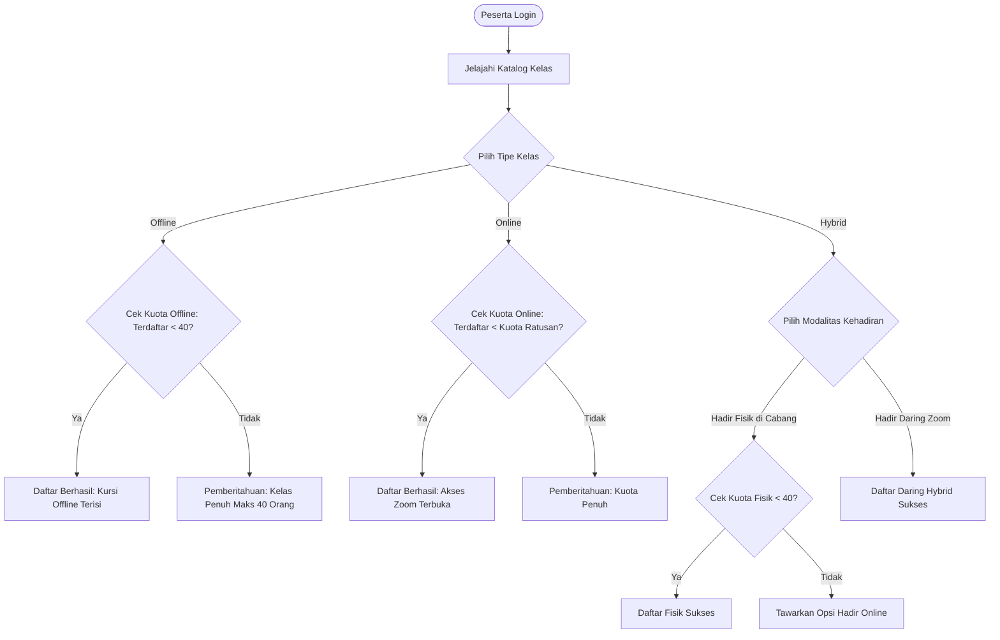
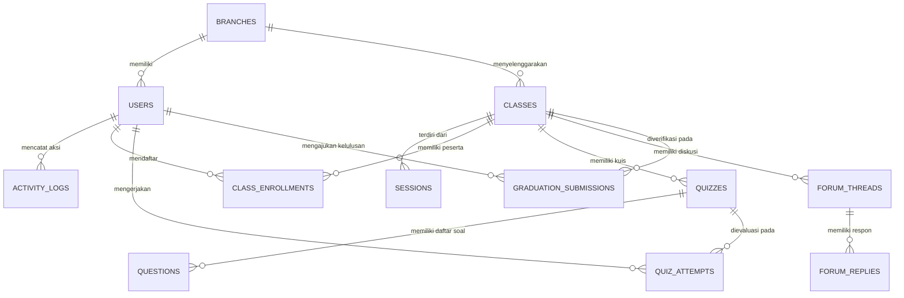

# PRODUCT REQUIREMENT DOCUMENT (PRD)
# Learning Management System (LMS) Terpadu Multi-Cabang

---

## 1. Informasi Dokumen & Ringkasan Eksekutif

| Dokumen | Deskripsi |
| :--- | :--- |
| **Nama Proyek** | Learning Management System (LMS) Terpadu Multi-Cabang |
| **Versi Dokumen** | 1.0.0 (Final Draft) |
| **Status** | Approved for Implementation |
| **Target Platform** | Web Application (Responsive Desktop & Mobile) |
| **Tech Stack** | PHP 8.4, Laravel 12/13, MySQL/MariaDB, Redis (Predis Cache), Tailwind CSS, Alpine.js, Spatie Permission |

### 1.1 Latar Belakang & Tujuan
Sistem ini dirancang sebagai platform manajemen pembelajaran dan sertifikasi kompetensi terpusat yang mendukung operasional multi-cabang. Platform ini memfasilitasi pelaksanaan pelatihan dalam berbagai modalitas (*Online*, *Offline*, dan *Hybrid*) dengan fokus utama pada pemenuhan standar **20 Jam Pelajaran (JP)** sebagai syarat kelulusan peserta yang diverifikasi langsung oleh Trainer.

### 1.2 Sasaran Utama (Key Objectives)
1. **Otomatisasi & Standardisasi Pelatihan**: Memastikan kurikulum 20 JP (1 JP = 45 menit) terstruktur, terukur, dan transparan.
2. **Kontrol Kapasitas Akurat**: Mencegah *overcapacity* pada kelas offline (maksimal 40 orang) dan mendukung ratusan peserta secara scalable pada kelas online dan hybrid.
3. **Akuntabilitas & Audit Trail**: Menyediakan pencatatan riwayat aktivitas (*Activity Log*) komprehensif bagi level manajemen (Super Admin dan Admin Cabang).
4. **Kolaborasi Interaktif**: Mengintegrasikan sesi daring (Zoom), forum komunitas diskusi, publikasi berita/pengumuman, dan evaluasi berbasis kuis.

---

## 2. Aturan Bisnis & Konvensi Sistem (Business Rules)

### BR-01: Standar Konversi Jam Pelajaran (JP)
* **1 JP (Jam Pelajaran) = 45 Menit**.
* Syarat kelulusan pelatihan adalah **20 JP kumulatif** (setara dengan **900 menit** atau **15 jam waktu efektif**).
* Komposisi pemenuhan 20 JP dapat dikonfigurasi pada kurikulum kelas, misalnya:
  * **Sesi Sinkronus (Tatap Muka / Live Zoom)**: Misal 10 JP (450 menit)
  * **Sesi Asinkronus (Materi Mandiri / Video / Bacaan)**: Misal 6 JP (270 menit)
  * **Pengerjaan Tugas & Evaluasi Kuis**: Misal 4 JP (180 menit)
* Peserta tidak dapat mengajukan verifikasi kelulusan sebelum akumulasi progres mencapai minimal 20 JP (100%).

### BR-02: Batasan & Validasi Kapasitas Kelas
| Tipe Kelas | Batas Kapasitas | Kebijakan & Validasi Sistem |
| :--- | :--- | :--- |
| **Offline** | **Maksimal 40 orang** | Sistem membatasi pendaftaran peserta maksimal 40 orang secara ketat (*hard limit*). Jika kuota telah mencapai 40, sistem otomatis mengunci pendaftaran kelas tersebut. |
| **Online** | **Ratusan peserta** (Default: 300 - 1000) | Pendaftaran terbuka dengan skala besar sesuai kapasitas lisensi Zoom/server. Pendaftaran ditutup otomatis jika kuota kustom yang ditentukan telah habis. |
| **Hybrid** | **Ratusan peserta** (Dengan kuota ganda) | Kelas Hybrid memiliki dua sub-kuota:<br>1. **Sub-kuota Kursi Offline**: Dibatasi maksimal 40 orang di ruangan kelas fisik cabang.<br>2. **Sub-kuota Online**: Ratusan peserta via Zoom.<br>Total kapasitas kelas merupakan gabungan keduanya. |

### BR-03: Kebijakan Kelulusan & Verifikasi (Graduation Workflow)
1. **Otomatisasi Prasyarat**: Peserta harus memenuhi seluruh check-point (Kehadiran sesi, waktu tonton materi, penyelesaian kuis dengan nilai $\ge$ Passing Grade).
2. **Status Pengajuan**: Saat 20 JP terpenuhi, sistem mengunci status peserta menjadi `Menunggu Verifikasi Trainer`.
3. **Kewenangan Trainer**: Trainer memiliki otoritas mutlak untuk:
   * **Menerima (Approve)**: Peserta dinyatakan LULUS. Sertifikat kelulusan digital (PDF dengan QR Code) otomatis dapat diakses/diunduh.
   * **Menolak (Reject)**: Peserta dinyatakan BELUM LULUS / WAJIB REMEDIAL. Trainer wajib menyertakan alasan penolakan dan instruksi perbaikan (misal: "Kuis Bab 3 perlu remedial", "Resume tugas 2 belum lengkap").

### BR-04: Akses Sesi Zoom
* Link Zoom dapat diinput oleh **Admin Cabang** (saat penjadwalan kelas) atau dibuat/diupdate oleh **Trainer** penanggung jawab kelas.
* Peserta hanya dapat melihat dan mengklik tombol "Masuk Zoom" apabila:
  1. Telah terdaftar secara resmi di kelas terkait.
  2. Waktu sesi telah aktif (misal: dibuka H-30 menit sebelum jadwal sesi dimulai).
* Setiap klik masuk ke Zoom dicatat ke log presensi peserta sebagai bukti kehadiran sinkronus.

---

## 3. Matriks Peran & Hak Akses (Role-Based Access Control / RBAC)

Sistem menggunakan 4 role hierarki:

```
[Super Admin]
      │
      ▼
[Admin Cabang]
      │
      ▼
  [Trainer]
      │
      ▼
  [Peserta]
```

| Modul / Fitur | Super Admin | Admin Cabang | Trainer | Peserta |
| :--- | :---: | :---: | :---: | :---: |
| **Kelola Akun Admin Cabang** | **CRUD (Semua Cabang)** | ❌ | ❌ | ❌ |
| **Log Aktivitas Admin** | **Read (Semua Admin)** | **Read (Cabang Sendiri)** | ❌ | ❌ |
| **Kelola Master Cabang** | **CRUD** | Read (Data Cabang Sendiri) | Read | Read (Info Lokasi) |
| **Kelola Akun Trainer** | Read Only | **CRUD (Di Cabangnya)** | Read (Profil Sendiri) | Read (Profil Pengajar) |
| **Kelola Kelas (Online/Hybrid/Offline)** | Read Only | **CRUD (Di Cabangnya)** | Read (Kelas yang Diampu) | Read & Enroll (Pilih Kelas) |
| **Kelola Bank Soal** | Read Only | **CRUD** | **CRUD** | ❌ (Hanya Menjawab) |
| **Kelola Kuis** | Read Only | **CRUD** | **CRUD** | Mengerjakan Kuis |
| **Input / Generate Link Zoom** | Read Only | **Create / Update** | **Create / Update** | Read & Join (Masuk Zoom) |
| **Kelola Forum / Komunitas** | Moderasi Global | Moderasi Cabang | **CRUD Thread & Post** | Create Post, Reply, Read |
| **Kelola Berita & Informasi** | **CRUD Global** | ❌ | **CRUD Informasi Kelas** | Read Only |
| **Tracking Pemenuhan 20 JP** | Read Global | Read Cabang | Read Rekap Peserta | **Tracking Progres Mandiri** |
| **Verifikasi / Approval 20 JP** | Read Status | Read Status | **Approve / Reject** | Cek Hasil Akhir |

---

## 4. Rincian Kebutuhan Fungsional per Pengguna

### 4.1 Modul Pengguna: Super Admin
* **1.1 CRUD Akun Admin Cabang**:
  * Menambah akun Admin Cabang baru dengan atribut: Nama, Email, Password, Nomor Kontak, dan Penugasan Cabang (*Branch Assignment*).
  * Menampilkan daftar Admin Cabang dengan filter cabang, status aktif/non-aktif, dan pencarian cepat.
  * Mengedit profil, mengubah penugasan cabang, atau reset kata sandi Admin Cabang.
  * Menonaktifkan (*deactivate*) atau menghapus akun Admin Cabang.
* **1.2 Log Aktivitas Admin**:
  * Menampilkan rekam jejak audit (*audit trail*) seluruh Admin Cabang di seluruh wilayah.
  * Informasi log mencakup: Timestamp, Nama Admin, Cabang, Tipe Aksi (*Create, Update, Delete, Login, Export*), Target Entitas (contoh: Kelas X, Soal Y), Alamat IP, dan Payload Perubahan (*Old values vs New values*).
  * Filter log berdasarkan rentang tanggal, nama admin, cabang, dan modul.
  * Kemampuan ekspor log aktivitas ke format Excel/PDF.

---

### 4.2 Modul Pengguna: Admin Cabang
* **2.1 CRUD Trainer**:
  * Pendaftaran akun Trainer yang terafiliasi khusus pada cabangnya.
  * Data trainer: Nama, NIP/ID, Spesialisasi/Keahlian, Email, No. WhatsApp, Bio, dan Dokumen Sertifikasi.
  * Manajemen status aktif/cuti trainer.
* **2.2 CRUD Soal (Bank Soal Cabang)**:
  * Pembuatan bank soal bertingkat: Pilihan Ganda (*Multiple Choice*), Pilihan Berganda Kompleks, True/False, dan Esai Singkat.
  * Kategori soal berdasarkan topik/modul pembelajaran (seluruh soal memiliki bobot setara/sama rata, tanpa pembagian mudah/sedang/sulit).
  * Import/Export soal via template spreadsheet (Excel/CSV).
* **2.3 Input Link Zoom**:
  * Menautkan tautan ruang Zoom (URL meeting, Meeting ID, Passcode) ke sesi kelas online maupun sesi daring kelas hybrid.
  * Pengaturan jadwal aktif tautan Zoom agar terhindar dari penyalahgunaan di luar jam kelas.
* **2.4 Log Aktivitas Cabang**:
  * Memantau log aktivitas operasional internal cabang (aktivitas pembuatan kelas, input soal, modifikasi jadwal oleh admin cabang dan trainer cabang).
* **2.5 CRUD Kuis**:
  * Mengonfigurasi paket kuis: Judul kuis, durasi waktu pengerjaan (menit), batas *passing grade* (misal minimal nilai 75), pengacakan urutan soal (*randomize*), dan batasan jumlah percobaan (*attempts*).
  * Menghubungkan paket kuis ke kurikulum kelas tertentu.
* **2.6 CRUD Kelas (Online, Hybrid, Offline)**:
  * Pembuatan kelas pelatihan dengan spesifikasi:
    * Nama kelas & kode batch.
    * Kategori pelatihan & silabus.
    * Tipe kelas:
      * **Offline**: Input kuota fisik ruangan (Maksimal 40 orang), nama ruangan/lab, alamat cabang.
      * **Online**: Input kapasitas peserta online (Ratusan), tautan live session.
      * **Hybrid**: Input kuota fisik offline (Maksimal 40 orang) + kuota online daring (Ratusan).
    * Tanggal mulai, tanggal selesai, dan penugasan Trainer utama serta pendamping.

---

### 4.3 Modul Pengguna: Trainer
* **3.1 CRUD Soal**:
  * Trainer dapat memperkaya bank soal untuk materi yang diampunya.
  * Membuat soal, kunci jawaban, dan pembahasan/penjelasan materi.
* **3.2 CRUD Kuis**:
  * Trainer dapat merancang kuis formatif (pre-test, kuis harian, post-test) untuk kelas yang diajarnya.
  * Mengoreksi jawaban esai peserta dan memberikan skor secara manual/otomatis.
* **3.3 CRUD Forum / Komunitas Diskusi**:
  * Membuka ruang diskusi/thread materi untuk memfasilitasi interaksi antar peserta.
  * Menjawab pertanyaan peserta, menyematkan postingan penting (*pin discussion*), dan memoderasi komentar.
* **3.4 CRUD Berita atau Informasi**:
  * Mempublikasikan pengumuman kelas, berita terhangat, instruksi tugas khusus, atau artikel edukatif kepada peserta didik.
  * Menentukan visibilitas berita (Publik / Khusus Peserta Kelas Tertentu).
* **3.5 Penerimaan / Penolakan Hasil Peserta (Verifikasi 20 JP)**:
  * Dashboard evaluasi peserta yang menampilkan rekap kemajuan belajar:
    * Akumulasi JP tercapai (Target: 20 JP = 900 Menit).
    * Daftar kehadiran pada setiap sesi.
    * Nilai kuis dan evaluasi tugas mandiri.
  * Tombol Aksi Verifikasi:
    * **Terima (Lulus)**: Memberikan predikat kelulusan (Sangat Baik, Baik, Cukup) dan catatan apresiasi.
    * **Tolak (Belum Lulus)**: Mengembalikan berkas dengan catatan alasan spesifik yang harus diperbaiki oleh peserta sebelum diajukan kembali.
* **3.6 Membuat Link Zoom**:
  * Trainer dapat menginisiasi dan memperbarui tautan Zoom secara instan untuk sesi tambahan, mentoring kelompok, atau asistensi tugas.

---

### 4.4 Modul Pengguna: Peserta
* **4.1 Pemenuhan Syarat 20 JP**:
  * Progress bar realtime pemenuhan JP (Contoh: "14 / 20 JP Selesai - 70%").
  * Rincian status aktivitas belajar per sesi (Modul materi, video interaktif yang dilengkapi timer deteksi kehadiran, pengerjaan kuis).
  * Sistem *timer check* yang memastikan durasi belajar setara dengan hitungan menit JP (1 JP = 45 menit).
* **4.2 Memilih Kelas**:
  * Katalog kelas yang tersedia di berbagai cabang dengan filter: Tipe Kelas (Online, Hybrid, Offline), Cabang, Jadwal, dan Kategori.
  * Realtime status ketersediaan kursi:
    * Kelas Offline: Menampilkan "Tersisa X dari 40 Kursi". Jika 40 terisi, tombol pendaftaran non-aktif (*Full Booked*).
    * Kelas Hybrid: Peserta dapat memilih tiket "Kehadiran Fisik (Maks 40)" atau "Kehadiran Online (Zoom)".
* **4.3 Melihat Berita**:
  * Membaca informasi pengumuman jadwal, artikel materi pendukung, dan informasi kegiatan cabang.
* **4.4 Mengunjungi Forum**:
  * Berinteraksi dalam thread komunitas, membuat pertanyaan kepada Trainer, dan berdiskusi dengan sesama peserta.
* **4.5 Cek Hasil & Status Kelulusan**:
  * Halaman hasil studi pribadi: Riwayat pengerjaan kuis, skor per materi, status verifikasi 20 JP (`Dalam Proses`, `Ditinjau Trainer`, `Lulus`, `Perlu Perbaikan`).
  * Jika disetujui (Lulus), tombol unduh E-Sertifikat resmi terbuka beserta QR Code verifikasi keaslian.
* **4.6 Masuk ke Zoom**:
  * Integrasi satu klik (*1-Click Join*) langsung ke aplikasi atau web Zoom tanpa perlu menginput ulang Meeting ID/Passcode secara manual.

---

## 5. Alur Pengguna & Arsitektur Alur Sistem (System Workflows)

### 5.1 Alur Pendaftaran & Pemilihan Kelas (Enrollment Flow)


### 5.2 Alur Pemenuhan & Verifikasi 20 JP (Graduation Verification Flow)
```mermaid
flowchart TD
    StartStudy([Peserta Memulai Kelas]) --> LearningActivity[Aktivitas Belajar:<br>- Sesi Tatap Muka/Zoom<br>- Materi Asinkronus<br>- Pengerjaan Kuis]
    LearningActivity --> CalcJP[Sistem Menghitung Akumulasi Waktu:<br>1 JP = 45 Menit]
    CalcJP --> ValidateJP{Total Waktu >= 900 Menit (20 JP) & Kuis Tuntas?}
    
    ValidateJP -->|Belum| ContinueStudy[Lanjutkan Materi yang Kurang]
    ContinueStudy --> LearningActivity
    
    ValidateJP -->|Sudah Terpenuhi| SubmitVerification[Status: Menunggu Verifikasi Trainer]
    SubmitVerification --> TrainerReview[Trainer Membuka Dashboard Review]
    
    TrainerReview --> TrainerDecision{Keputusan Trainer}
    TrainerDecision -->|Setuju / Approve| ApproveStudent[Status: LULUS<br>Generate E-Sertifikat dengan QR Code]
    TrainerDecision -->|Tolak / Reject| RejectStudent[Status: PERBAIKAN / REMEDIAL<br>Trainer Mengirim Feedback Catatan Revisi]
    
    RejectStudent --> RemedialAction[Peserta Membaca Catatan & Menyelesaikan Remedial]
    RemedialAction --> SubmitVerification
```

---

## 6. Desain Skema Database (Database Schema Architecture)

Berdasarkan framework Laravel dan paket `spatie/laravel-permission`, berikut adalah spesifikasi entitas data utama:



### 6.1 Tabel `branches` (Cabang)
* `id`: BIGINT UNSIGNED (Primary Key)
* `name`: VARCHAR(150) — Nama Cabang (misal: Cabang Jakarta Pusat, Cabang Surabaya)
* `code`: VARCHAR(20) UNIQUE — Kode unik cabang
* `address`: TEXT — Alamat fisik cabang
* `city`: VARCHAR(100)
* `phone`: VARCHAR(30)
* `is_active`: BOOLEAN DEFAULT true
* `created_at`, `updated_at`

### 6.2 Tabel `users` (Pengguna Multi-Peran)
* `id`: BIGINT UNSIGNED (Primary Key)
* `branch_id`: BIGINT UNSIGNED NULLABLE (Foreign Key ke `branches.id`) — *Null untuk Super Admin*
* `name`: VARCHAR(255)
* `email`: VARCHAR(255) UNIQUE
* `password`: VARCHAR(255)
* `phone_number`: VARCHAR(30)
* `avatar_url`: VARCHAR(255) NULLABLE
* `status`: ENUM('active', 'inactive', 'suspended') DEFAULT 'active'
* `email_verified_at`: TIMESTAMP NULLABLE
* `created_at`, `updated_at`
*(Role ditangani oleh tabel `roles` & `model_has_roles` dari Spatie Permission: `super-admin`, `admin-cabang`, `trainer`, `peserta`)*

### 6.3 Tabel `activity_logs` (Audit Trail)
* `id`: BIGINT UNSIGNED (Primary Key)
* `user_id`: BIGINT UNSIGNED (Foreign Key ke `users.id`)
* `branch_id`: BIGINT UNSIGNED NULLABLE
* `action`: VARCHAR(100) — misal: 'CREATE_TRAINER', 'UPDATE_ZOOM_LINK', 'APPROVE_GRADUATION'
* `target_entity`: VARCHAR(100) — misal: 'App\Models\Classes', 'App\Models\User'
* `target_id`: BIGINT UNSIGNED NULLABLE
* `description`: TEXT
* `properties_old`: JSON NULLABLE
* `properties_new`: JSON NULLABLE
* `ip_address`: VARCHAR(45)
* `user_agent`: TEXT
* `created_at`

### 6.4 Tabel `classes` (Kelas Pelatihan)
* `id`: BIGINT UNSIGNED (Primary Key)
* `branch_id`: BIGINT UNSIGNED (Foreign Key ke `branches.id`)
* `trainer_id`: BIGINT UNSIGNED (Foreign Key ke `users.id`)
* `title`: VARCHAR(255)
* `slug`: VARCHAR(255) UNIQUE
* `type`: ENUM('online', 'hybrid', 'offline')
* `offline_capacity`: INT UNSIGNED DEFAULT 40 — **Maksimal 40 untuk offline / sub-kuota offline hybrid**
* `online_capacity`: INT UNSIGNED DEFAULT 500 — **Ratusan untuk online / sub-kuota online hybrid**
* `enrolled_offline_count`: INT UNSIGNED DEFAULT 0
* `enrolled_online_count`: INT UNSIGNED DEFAULT 0
* `required_jp`: INT UNSIGNED DEFAULT 20 — Default 20 JP
* `start_date`: DATE
* `end_date`: DATE
* `status`: ENUM('draft', 'open_registration', 'ongoing', 'completed', 'cancelled')
* `created_at`, `updated_at`

### 6.5 Tabel `class_schedules` / `sessions` (Sesi Belajar & Zoom)
* `id`: BIGINT UNSIGNED (Primary Key)
* `class_id`: BIGINT UNSIGNED (Foreign Key ke `classes.id`)
* `title`: VARCHAR(255)
* `jp_duration`: INT UNSIGNED — Jumlah JP pada sesi ini (misal 2 JP = 90 menit)
* `minute_duration`: INT UNSIGNED — Total menit (jp_duration * 45)
* `session_date`: DATETIME
* `zoom_meeting_url`: TEXT NULLABLE — Link Zoom
* `zoom_meeting_id`: VARCHAR(100) NULLABLE
* `zoom_passcode`: VARCHAR(100) NULLABLE
* `created_by_user_id`: BIGINT UNSIGNED (Admin Cabang / Trainer)
* `created_at`, `updated_at`

### 6.6 Tabel `class_enrollments` (Pendaftaran Peserta)
* `id`: BIGINT UNSIGNED (Primary Key)
* `class_id`: BIGINT UNSIGNED (Foreign Key ke `classes.id`)
* `user_id`: BIGINT UNSIGNED (Foreign Key ke `users.id`)
* `attendance_mode`: ENUM('offline', 'online') — *Penting untuk kelas Hybrid*
* `completed_minutes`: INT UNSIGNED DEFAULT 0 — Akumulasi menit kehadiran & belajar
* `completed_jp`: DECIMAL(4,1) DEFAULT 0.0 — Menit / 45
* `status`: ENUM('enrolled', 'in_progress', 'review_pending', 'graduated', 'rejected')
* `enrolled_at`: TIMESTAMP
* `created_at`, `updated_at`
* UNIQUE (`class_id`, `user_id`)

### 6.7 Tabel `questions` & `question_options` (Bank Soal)
* `id`: BIGINT UNSIGNED (Primary Key)
* `branch_id`: BIGINT UNSIGNED (Foreign Key ke `branches.id`)
* `creator_id`: BIGINT UNSIGNED (Foreign Key ke `users.id`)
* `question_text`: LONGTEXT
* `question_type`: ENUM('multiple_choice', 'true_false', 'essay')
* `score_weight`: INT DEFAULT 1
* `explanation`: TEXT NULLABLE
* `created_at`, `updated_at`

### 6.8 Tabel `quizzes` & `quiz_attempts` (Kuis & Hasil)
* `quizzes`:
  * `id`: BIGINT UNSIGNED (Primary Key)
  * `class_id`: BIGINT UNSIGNED (Foreign Key ke `classes.id`)
  * `title`: VARCHAR(255)
  * `time_limit_minutes`: INT UNSIGNED — Durasi pengerjaan
  * `passing_grade`: DECIMAL(5,2) DEFAULT 75.00
  * `is_randomized`: BOOLEAN DEFAULT true
* `quiz_attempts`:
  * `id`: BIGINT UNSIGNED (Primary Key)
  * `quiz_id`: BIGINT UNSIGNED (Foreign Key ke `quizzes.id`)
  * `user_id`: BIGINT UNSIGNED (Foreign Key ke `users.id`)
  * `total_score`: DECIMAL(5,2)
  * `is_passed`: BOOLEAN
  * `started_at`: TIMESTAMP
  * `submitted_at`: TIMESTAMP NULLABLE

### 6.9 Tabel `graduation_submissions` (Verifikasi Kelulusan 20 JP)
* `id`: BIGINT UNSIGNED (Primary Key)
* `enrollment_id`: BIGINT UNSIGNED (Foreign Key ke `class_enrollments.id`)
* `trainer_id`: BIGINT UNSIGNED NULLABLE (Foreign Key ke `users.id`)
* `jp_accumulated`: DECIMAL(4,1) — Harus $\ge$ 20.0
* `average_quiz_score`: DECIMAL(5,2)
* `status`: ENUM('pending', 'approved', 'rejected') DEFAULT 'pending'
* `trainer_feedback`: TEXT NULLABLE — Catatan review atau alasan penolakan
* `reviewed_at`: TIMESTAMP NULLABLE
* `certificate_number`: VARCHAR(100) UNIQUE NULLABLE
* `certificate_url`: VARCHAR(255) NULLABLE
* `created_at`, `updated_at`

### 6.10 Tabel `forums` & `news_posts` (Komunitas & Berita)
* `forum_threads`:
  * `id`, `class_id`, `author_id`, `title`, `content`, `is_pinned`, `created_at`, `updated_at`
* `forum_replies`:
  * `id`, `thread_id`, `author_id`, `reply_content`, `created_at`, `updated_at`
* `news_posts`:
  * `id`, `author_id`, `branch_id` (nullable for global), `title`, `slug`, `content`, `thumbnail_url`, `is_published`, `created_at`, `updated_at`

---

## 7. Kebutuhan Non-Fungsional (Non-Functional Requirements)

1. **Keamanan Data & Otorisasi**:
   * Proteksi *route* berbasis Spatie Permission Middleware (`role:super-admin`, `role:admin-cabang`, dll).
   * Validasi multi-tenant level cabang (*Branch Isolation*): Admin Cabang dan Trainer hanya dapat memodifikasi resource data di cabangnya sendiri.
   * Sanitasi input untuk mencegah serangan SQL Injection, Cross-Site Scripting (XSS), dan Cross-Site Request Forgery (CSRF).
2. **Kinerja & Skalabilitas (Performance & Concurrency)**:
   * Penggunaan database index pada kolom-kolom relasi kritis (`branch_id`, `class_id`, `user_id`, `status`).
   * Validasi *Atomic Database Transaction* dan *Pessimistic Locking* (`lockForUpdate()`) saat proses pendaftaran kelas offline untuk mencegah *race condition* kursi melebihi kapasitas 40 orang.
3. **UI / UX & Responsivitas**:
   * Desain antarmuka modern dengan Tailwind CSS (palet warna terstandardisasi, tipografi Inter/Roboto, transisi halus, dark/light contrast yang elegan).
   * Aksesibilitas navigasi pada perangkat smartphone, tablet, dan PC/Laptop.
4. **Auditability**:
   * Setiap mutasi data penting (perubahan link zoom, perubahan kuota kelas, approval/reject kelulusan) otomatis memicu perekaman di `activity_logs`.

---

## 8. Milestone & Rencana Tahapan Implementasi (Roadmap)

| Tahap | Fokus Pekerjaan | Deliverable Utama |
| :---: | :--- | :--- |
| **Fase 1** | **Fondasi & Autentikasi RBAC** | - Setup Database Migrations & Seeders (Role & Permission).<br>- CRUD Admin Cabang & Manajemen Cabang.<br>- Logging Aktivitas Terpusat. |
| **Fase 2** | **Manajemen Kelas & Logika Kapasitas** | - CRUD Trainer oleh Admin Cabang.<br>- CRUD Kelas (Offline maks 40, Online, Hybrid kuota ganda).<br>- Engine Pendaftaran (*Enrollment Engine*) dengan validasi kuota anti-race condition. |
| **Fase 3** | **Evaluasi Pembelajaran & Bank Soal** | - CRUD Bank Soal & Kuis.<br>- Engine Pengerjaan Kuis Peserta & Penskoran Otomatis.<br>- Input & Integrasi Link Zoom. |
| **Fase 4** | **Sistem Pemenuhan 20 JP & Kelulusan** | - Engine Perhitungan Durasi JP (1 JP = 45 menit, akumulasi 900 menit).<br>- Dashboard Review & Approval/Reject bagi Trainer.<br>- Generator Sertifikat Kelulusan PDF & QR Code. |
| **Fase 5** | **Interaksi Komunitas & Polish** | - Modul Berita & Informasi.<br>- Forum Diskusi / Komunitas Kelas.<br>- Pengujian End-to-End & Uji Beban. |
