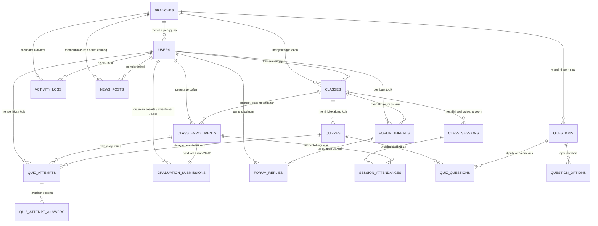

# 🗄️ DATABASE SCHEMA SPECIFICATION
## Learning Management System (LMS) Terpadu Multi-Cabang

Dokumen ini memuat spesifikasi teknis lengkap skema basis data (*database schema*), tipe data, indeks, relasi kunci (*foreign keys*), aturan integritas (*integrity constraints*), serta rumus kalkulasi bisnis untuk sistem LMS.

---

### 1. Diagram Relasi Entitas (Entity Relationship Diagram)



---

### 2. Aturan Integritas & Rumus Bisnis Data

1. **Konversi Jam Pelajaran (JP)**:
   $$\text{completed\_jp} = \frac{\text{accumulated\_minutes}}{45}$$
   * Syarat mutlak pengajuan verifikasi kelulusan: $\text{accumulated\_minutes} \ge 900$ menit (setara dengan $20.0$ JP).

2. **Aturan Kapasitas Kelas**:
   * **Kelas Offline**: `enrolled_offline` $\le$ `offline_capacity` (Ketat / *Hard limit* maksimal 40).
   * **Kelas Online**: `enrolled_online` $\le$ `online_capacity` (Kapasitas ratusan, default: 500).
   * **Kelas Hybrid**: Memiliki dua kuota terpisah:
     * `enrolled_offline` $\le$ `offline_capacity` (Maksimal 40 orang di ruangan kelas).
     * `enrolled_online` $\le$ `online_capacity` (Ratusan via sesi daring Zoom).

3. **Integritas Konkurensi Pendaftaran (Anti-Overbooking)**:
   * Setiap proses pendaftaran kelas wajib menggunakan transaksi database dengan *pessimistic lock*:
     ```php
     DB::transaction(function () use ($classId, $userId, $mode) {
         $class = Classes::where('id', $classId)->lockForUpdate()->first();
         // Validasi kuota 40 offline atau kuota online
         // Simpan enrollment
     });
     ```

4. **Bank Soal Setara (Uniform Weight)**:
   * Seluruh soal memiliki bobot default sama rata (`score_weight = 1`). Tidak ada klasifikasi soal berjenjang (mudah/sedang/sulit).

---

### 3. Rincian Spesifikasi Tabel

#### 3.1 Tabel `branches` (Master Cabang)
Menyimpan identitas kantor cabang yang menyelenggarakan pelatihan.

```sql
CREATE TABLE branches (
    id BIGINT UNSIGNED AUTO_INCREMENT PRIMARY KEY,
    name VARCHAR(150) NOT NULL,
    code VARCHAR(20) NOT NULL UNIQUE,
    address TEXT NOT NULL,
    city VARCHAR(100) NOT NULL,
    phone VARCHAR(30) NULL,
    is_active BOOLEAN NOT NULL DEFAULT TRUE,
    created_at TIMESTAMP NULL,
    updated_at TIMESTAMP NULL,
    INDEX idx_branches_is_active (is_active)
) ENGINE=InnoDB DEFAULT CHARSET=utf8mb4 COLLATE=utf8mb4_unicode_ci;
```

---

#### 3.2 Tabel `users` & RBAC
Menyimpan seluruh data pengguna. Relasi hak akses ditangani menggunakan tabel standar `spatie/laravel-permission` (`roles`, `permissions`, `model_has_roles`, dll) dengan 4 role: `super-admin`, `admin-cabang`, `trainer`, `peserta`.

```sql
CREATE TABLE users (
    id BIGINT UNSIGNED AUTO_INCREMENT PRIMARY KEY,
    branch_id BIGINT UNSIGNED NULL,
    name VARCHAR(255) NOT NULL,
    email VARCHAR(255) NOT NULL UNIQUE,
    password VARCHAR(255) NOT NULL,
    phone_number VARCHAR(30) NULL,
    avatar VARCHAR(255) NULL,
    status ENUM('active', 'inactive') NOT NULL DEFAULT 'active',
    email_verified_at TIMESTAMP NULL,
    remember_token VARCHAR(100) NULL,
    created_at TIMESTAMP NULL,
    updated_at TIMESTAMP NULL,
    CONSTRAINT fk_users_branch FOREIGN KEY (branch_id) 
        REFERENCES branches(id) ON DELETE SET NULL,
    INDEX idx_users_status (status),
    INDEX idx_users_branch (branch_id)
) ENGINE=InnoDB DEFAULT CHARSET=utf8mb4 COLLATE=utf8mb4_unicode_ci;
```

---

#### 3.3 Tabel `activity_logs` (Audit Trail Sesuai Fitur 1.2 & 2.4)
Merekam seluruh riwayat perubahan dan aktivitas operasional admin untuk audit trail.

```sql
CREATE TABLE activity_logs (
    id BIGINT UNSIGNED AUTO_INCREMENT PRIMARY KEY,
    user_id BIGINT UNSIGNED NOT NULL,
    branch_id BIGINT UNSIGNED NULL,
    action VARCHAR(100) NOT NULL, -- Contoh: 'CREATE_CLASS', 'UPDATE_ZOOM', 'APPROVE_GRADUATION'
    target_entity VARCHAR(100) NOT NULL, -- Contoh: 'App\Models\Classes', 'App\Models\User'
    target_id BIGINT UNSIGNED NULL,
    description TEXT NOT NULL,
    properties_old JSON NULL,
    properties_new JSON NULL,
    ip_address VARCHAR(45) NOT NULL,
    user_agent TEXT NULL,
    created_at TIMESTAMP NOT NULL DEFAULT CURRENT_TIMESTAMP,
    CONSTRAINT fk_logs_user FOREIGN KEY (user_id) 
        REFERENCES users(id) ON DELETE CASCADE,
    CONSTRAINT fk_logs_branch FOREIGN KEY (branch_id) 
        REFERENCES branches(id) ON DELETE SET NULL,
    INDEX idx_logs_action (action),
    INDEX idx_logs_created_at (created_at),
    INDEX idx_logs_branch (branch_id)
) ENGINE=InnoDB DEFAULT CHARSET=utf8mb4 COLLATE=utf8mb4_unicode_ci;
```

---

#### 3.4 Tabel `classes` (Kelas Pelatihan)
Mewadahi kelas Online, Offline (maks 40), dan Hybrid.

```sql
CREATE TABLE classes (
    id BIGINT UNSIGNED AUTO_INCREMENT PRIMARY KEY,
    branch_id BIGINT UNSIGNED NOT NULL,
    trainer_id BIGINT UNSIGNED NOT NULL,
    title VARCHAR(255) NOT NULL,
    slug VARCHAR(255) NOT NULL UNIQUE,
    description TEXT NULL,
    type ENUM('offline', 'online', 'hybrid') NOT NULL,
    offline_capacity INT UNSIGNED NOT NULL DEFAULT 40, -- Maks 40 orang untuk offline / kursi fisik hybrid
    online_capacity INT UNSIGNED NOT NULL DEFAULT 500, -- Ratusan peserta untuk online / online hybrid
    enrolled_offline INT UNSIGNED NOT NULL DEFAULT 0,
    enrolled_online INT UNSIGNED NOT NULL DEFAULT 0,
    required_jp INT UNSIGNED NOT NULL DEFAULT 20, -- Target pemenuhan 20 JP
    start_date DATE NOT NULL,
    end_date DATE NOT NULL,
    status ENUM('draft', 'open', 'ongoing', 'completed', 'cancelled') NOT NULL DEFAULT 'draft',
    created_at TIMESTAMP NULL,
    updated_at TIMESTAMP NULL,
    CONSTRAINT fk_classes_branch FOREIGN KEY (branch_id) 
        REFERENCES branches(id) ON DELETE CASCADE,
    CONSTRAINT fk_classes_trainer FOREIGN KEY (trainer_id) 
        REFERENCES users(id) ON DELETE RESTRICT,
    INDEX idx_classes_status (status),
    INDEX idx_classes_type (type),
    INDEX idx_classes_dates (start_date, end_date)
) ENGINE=InnoDB DEFAULT CHARSET=utf8mb4 COLLATE=utf8mb4_unicode_ci;
```

---

#### 3.5 Tabel `class_sessions` (Jadwal Pertemuan, JP & Integrasi Zoom)
Menyimpan rincian sesi pertemuan kelas, durasi JP, durasi menit, dan link Zoom (Fitur 2.3 & 3.6).

```sql
CREATE TABLE class_sessions (
    id BIGINT UNSIGNED AUTO_INCREMENT PRIMARY KEY,
    class_id BIGINT UNSIGNED NOT NULL,
    session_order INT UNSIGNED NOT NULL, -- Sesi ke-1, 2, dst
    title VARCHAR(255) NOT NULL,
    jp_duration INT UNSIGNED NOT NULL DEFAULT 2, -- Contoh: 2 JP
    minute_duration INT UNSIGNED NOT NULL DEFAULT 90, -- jp_duration * 45 menit
    session_date DATETIME NOT NULL,
    zoom_url TEXT NULL, -- Tautan masuk Zoom
    zoom_meeting_id VARCHAR(100) NULL,
    zoom_passcode VARCHAR(100) NULL,
    created_by_user_id BIGINT UNSIGNED NOT NULL,
    created_at TIMESTAMP NULL,
    updated_at TIMESTAMP NULL,
    CONSTRAINT fk_sessions_class FOREIGN KEY (class_id) 
        REFERENCES classes(id) ON DELETE CASCADE,
    CONSTRAINT fk_sessions_creator FOREIGN KEY (created_by_user_id) 
        REFERENCES users(id) ON DELETE RESTRICT,
    INDEX idx_sessions_class_order (class_id, session_order),
    INDEX idx_sessions_date (session_date)
) ENGINE=InnoDB DEFAULT CHARSET=utf8mb4 COLLATE=utf8mb4_unicode_ci;
```

---

#### 3.6 Tabel `class_enrollments` (Pendaftaran Peserta & Tracking JP)
Mencatat pendaftaran peserta di kelas serta akumulasi menit belajar/kehadiran.

```sql
CREATE TABLE class_enrollments (
    id BIGINT UNSIGNED AUTO_INCREMENT PRIMARY KEY,
    class_id BIGINT UNSIGNED NOT NULL,
    user_id BIGINT UNSIGNED NOT NULL,
    attendance_mode ENUM('offline', 'online') NOT NULL DEFAULT 'offline', -- Pilihan hadir fisik atau zoom (terutama pada Hybrid)
    accumulated_minutes INT UNSIGNED NOT NULL DEFAULT 0, -- Total menit belajar tuntas
    accumulated_jp DECIMAL(4, 1) NOT NULL DEFAULT 0.0, -- accumulated_minutes / 45
    status ENUM('enrolled', 'in_progress', 'review_pending', 'graduated', 'rejected') NOT NULL DEFAULT 'enrolled',
    enrolled_at TIMESTAMP NOT NULL DEFAULT CURRENT_TIMESTAMP,
    created_at TIMESTAMP NULL,
    updated_at TIMESTAMP NULL,
    CONSTRAINT fk_enrollments_class FOREIGN KEY (class_id) 
        REFERENCES classes(id) ON DELETE CASCADE,
    CONSTRAINT fk_enrollments_user FOREIGN KEY (user_id) 
        REFERENCES users(id) ON DELETE CASCADE,
    UNIQUE KEY uk_class_user (class_id, user_id),
    INDEX idx_enrollments_status (status)
) ENGINE=InnoDB DEFAULT CHARSET=utf8mb4 COLLATE=utf8mb4_unicode_ci;
```

---

#### 3.7 Tabel `session_attendances` (Presensi Sesi & Log Masuk Zoom)
Mencatat bukti kehadiran peserta pada setiap sesi (Fitur 4.6).

```sql
CREATE TABLE session_attendances (
    id BIGINT UNSIGNED AUTO_INCREMENT PRIMARY KEY,
    enrollment_id BIGINT UNSIGNED NOT NULL,
    session_id BIGINT UNSIGNED NOT NULL,
    joined_zoom_at TIMESTAMP NULL, -- Waktu peserta klik 'Masuk Zoom'
    minutes_earned INT UNSIGNED NOT NULL DEFAULT 0, -- Menit belajar yang disahkan
    is_verified BOOLEAN NOT NULL DEFAULT FALSE, -- Diverifikasi oleh Trainer
    created_at TIMESTAMP NULL,
    updated_at TIMESTAMP NULL,
    CONSTRAINT fk_attendances_enrollment FOREIGN KEY (enrollment_id) 
        REFERENCES class_enrollments(id) ON DELETE CASCADE,
    CONSTRAINT fk_attendances_session FOREIGN KEY (session_id) 
        REFERENCES class_sessions(id) ON DELETE CASCADE,
    UNIQUE KEY uk_enrollment_session (enrollment_id, session_id)
) ENGINE=InnoDB DEFAULT CHARSET=utf8mb4 COLLATE=utf8mb4_unicode_ci;
```

---

#### 3.8 Tabel `questions` & `question_options` (Bank Soal)
Menyimpan bank soal yang dibuat Admin Cabang atau Trainer. *Seluruh soal sama rata tanpa klasifikasi kesulitan.*

```sql
CREATE TABLE questions (
    id BIGINT UNSIGNED AUTO_INCREMENT PRIMARY KEY,
    branch_id BIGINT UNSIGNED NOT NULL,
    creator_id BIGINT UNSIGNED NOT NULL,
    question_text LONGTEXT NOT NULL,
    question_type ENUM('multiple_choice', 'true_false', 'essay') NOT NULL DEFAULT 'multiple_choice',
    score_weight INT UNSIGNED NOT NULL DEFAULT 1, -- Bobot setara/sama rata
    explanation TEXT NULL,
    created_at TIMESTAMP NULL,
    updated_at TIMESTAMP NULL,
    CONSTRAINT fk_questions_branch FOREIGN KEY (branch_id) 
        REFERENCES branches(id) ON DELETE CASCADE,
    CONSTRAINT fk_questions_creator FOREIGN KEY (creator_id) 
        REFERENCES users(id) ON DELETE RESTRICT,
    INDEX idx_questions_branch_type (branch_id, question_type)
) ENGINE=InnoDB DEFAULT CHARSET=utf8mb4 COLLATE=utf8mb4_unicode_ci;

CREATE TABLE question_options (
    id BIGINT UNSIGNED AUTO_INCREMENT PRIMARY KEY,
    question_id BIGINT UNSIGNED NOT NULL,
    option_text TEXT NOT NULL,
    is_correct BOOLEAN NOT NULL DEFAULT FALSE,
    option_order INT UNSIGNED NOT NULL DEFAULT 1,
    CONSTRAINT fk_options_question FOREIGN KEY (question_id) 
        REFERENCES questions(id) ON DELETE CASCADE
) ENGINE=InnoDB DEFAULT CHARSET=utf8mb4 COLLATE=utf8mb4_unicode_ci;
```

---

#### 3.9 Tabel Evaluasi Kuis (`quizzes`, `quiz_questions`, `quiz_attempts`, `quiz_attempt_answers`)

```sql
-- Definisi Paket Kuis
CREATE TABLE quizzes (
    id BIGINT UNSIGNED AUTO_INCREMENT PRIMARY KEY,
    class_id BIGINT UNSIGNED NOT NULL,
    creator_id BIGINT UNSIGNED NOT NULL,
    title VARCHAR(255) NOT NULL,
    description TEXT NULL,
    time_limit_minutes INT UNSIGNED NOT NULL DEFAULT 30, -- Batas waktu pengerjaan
    passing_grade DECIMAL(5, 2) NOT NULL DEFAULT 75.00, -- Nilai minimal lulus kuis
    is_randomized BOOLEAN NOT NULL DEFAULT TRUE, -- Acak urutan soal
    max_attempts INT UNSIGNED NOT NULL DEFAULT 1,
    created_at TIMESTAMP NULL,
    updated_at TIMESTAMP NULL,
    CONSTRAINT fk_quizzes_class FOREIGN KEY (class_id) 
        REFERENCES classes(id) ON DELETE CASCADE,
    CONSTRAINT fk_quizzes_creator FOREIGN KEY (creator_id) 
        REFERENCES users(id) ON DELETE RESTRICT
) ENGINE=InnoDB DEFAULT CHARSET=utf8mb4 COLLATE=utf8mb4_unicode_ci;

-- Relasi Many-to-Many Soal di Kuis
CREATE TABLE quiz_questions (
    id BIGINT UNSIGNED AUTO_INCREMENT PRIMARY KEY,
    quiz_id BIGINT UNSIGNED NOT NULL,
    question_id BIGINT UNSIGNED NOT NULL,
    order_number INT UNSIGNED NOT NULL DEFAULT 1,
    CONSTRAINT fk_qq_quiz FOREIGN KEY (quiz_id) 
        REFERENCES quizzes(id) ON DELETE CASCADE,
    CONSTRAINT fk_qq_question FOREIGN KEY (question_id) 
        REFERENCES questions(id) ON DELETE RESTRICT,
    UNIQUE KEY uk_quiz_question (quiz_id, question_id)
) ENGINE=InnoDB DEFAULT CHARSET=utf8mb4 COLLATE=utf8mb4_unicode_ci;

-- Rekaman Percobaan Kuis oleh Peserta
CREATE TABLE quiz_attempts (
    id BIGINT UNSIGNED AUTO_INCREMENT PRIMARY KEY,
    quiz_id BIGINT UNSIGNED NOT NULL,
    enrollment_id BIGINT UNSIGNED NOT NULL,
    attempt_number INT UNSIGNED NOT NULL DEFAULT 1,
    total_score DECIMAL(5, 2) NOT NULL DEFAULT 0.00,
    is_passed BOOLEAN NOT NULL DEFAULT FALSE,
    started_at TIMESTAMP NOT NULL DEFAULT CURRENT_TIMESTAMP,
    submitted_at TIMESTAMP NULL,
    CONSTRAINT fk_attempts_quiz FOREIGN KEY (quiz_id) 
        REFERENCES quizzes(id) ON DELETE CASCADE,
    CONSTRAINT fk_attempts_enrollment FOREIGN KEY (enrollment_id) 
        REFERENCES class_enrollments(id) ON DELETE CASCADE,
    INDEX idx_attempts_passed (is_passed)
) ENGINE=InnoDB DEFAULT CHARSET=utf8mb4 COLLATE=utf8mb4_unicode_ci;

-- Jawaban Butir Soal Peserta
CREATE TABLE quiz_attempt_answers (
    id BIGINT UNSIGNED AUTO_INCREMENT PRIMARY KEY,
    attempt_id BIGINT UNSIGNED NOT NULL,
    question_id BIGINT UNSIGNED NOT NULL,
    selected_option_id BIGINT UNSIGNED NULL, -- Jawaban pilihan ganda
    essay_answer TEXT NULL, -- Jawaban esai
    is_correct BOOLEAN NOT NULL DEFAULT FALSE,
    score_earned DECIMAL(5, 2) NOT NULL DEFAULT 0.00,
    CONSTRAINT fk_qaa_attempt FOREIGN KEY (attempt_id) 
        REFERENCES quiz_attempts(id) ON DELETE CASCADE,
    CONSTRAINT fk_qaa_question FOREIGN KEY (question_id) 
        REFERENCES questions(id) ON DELETE RESTRICT,
    CONSTRAINT fk_qaa_option FOREIGN KEY (selected_option_id) 
        REFERENCES question_options(id) ON DELETE SET NULL
) ENGINE=InnoDB DEFAULT CHARSET=utf8mb4 COLLATE=utf8mb4_unicode_ci;
```

---

#### 3.10 Tabel `graduation_submissions` (Verifikasi Kelulusan 20 JP & Sertifikat)
Menyimpan alur verifikasi penuntasan 20 JP yang disetujui atau ditolak oleh Trainer (Fitur 3.5 & 4.5).

```sql
CREATE TABLE graduation_submissions (
    id BIGINT UNSIGNED AUTO_INCREMENT PRIMARY KEY,
    enrollment_id BIGINT UNSIGNED NOT NULL UNIQUE,
    trainer_id BIGINT UNSIGNED NULL, -- Trainer penilai
    total_jp_earned DECIMAL(4, 1) NOT NULL, -- Minimal 20.0 JP
    avg_quiz_score DECIMAL(5, 2) NOT NULL DEFAULT 0.00,
    status ENUM('pending', 'approved', 'rejected') NOT NULL DEFAULT 'pending',
    trainer_feedback TEXT NULL, -- Wajib diisi jika status = 'rejected' (instruksi perbaikan)
    reviewed_at TIMESTAMP NULL,
    certificate_number VARCHAR(100) NULL UNIQUE, -- Contoh: 'CERT-2026-JKT-0012'
    certificate_path VARCHAR(255) NULL, -- Lokasi file PDF E-Sertifikat
    qr_verification_code VARCHAR(255) NULL, -- Tautan verifikasi QR Code keaslian
    created_at TIMESTAMP NULL,
    updated_at TIMESTAMP NULL,
    CONSTRAINT fk_grad_enrollment FOREIGN KEY (enrollment_id) 
        REFERENCES class_enrollments(id) ON DELETE CASCADE,
    CONSTRAINT fk_grad_trainer FOREIGN KEY (trainer_id) 
        REFERENCES users(id) ON DELETE SET NULL,
    INDEX idx_grad_status (status)
) ENGINE=InnoDB DEFAULT CHARSET=utf8mb4 COLLATE=utf8mb4_unicode_ci;
```

---

#### 3.11 Tabel Komunitas & Berita (`forum_threads`, `forum_replies`, `news_posts`)

```sql
-- Berita & Pengumuman Informasi (Fitur 3.4 & 4.3)
CREATE TABLE news_posts (
    id BIGINT UNSIGNED AUTO_INCREMENT PRIMARY KEY,
    branch_id BIGINT UNSIGNED NULL, -- Null jika berita bersifat nasional/global
    author_id BIGINT UNSIGNED NOT NULL,
    title VARCHAR(255) NOT NULL,
    slug VARCHAR(255) NOT NULL UNIQUE,
    content LONGTEXT NOT NULL,
    thumbnail VARCHAR(255) NULL,
    is_published BOOLEAN NOT NULL DEFAULT TRUE,
    published_at TIMESTAMP NULL,
    created_at TIMESTAMP NULL,
    updated_at TIMESTAMP NULL,
    CONSTRAINT fk_news_branch FOREIGN KEY (branch_id) 
        REFERENCES branches(id) ON DELETE CASCADE,
    CONSTRAINT fk_news_author FOREIGN KEY (author_id) 
        REFERENCES users(id) ON DELETE RESTRICT,
    INDEX idx_news_published (is_published, published_at)
) ENGINE=InnoDB DEFAULT CHARSET=utf8mb4 COLLATE=utf8mb4_unicode_ci;

-- Forum Diskusi Kelas (Fitur 3.3 & 4.4)
CREATE TABLE forum_threads (
    id BIGINT UNSIGNED AUTO_INCREMENT PRIMARY KEY,
    class_id BIGINT UNSIGNED NOT NULL,
    author_id BIGINT UNSIGNED NOT NULL,
    title VARCHAR(255) NOT NULL,
    content TEXT NOT NULL,
    is_pinned BOOLEAN NOT NULL DEFAULT FALSE,
    is_locked BOOLEAN NOT NULL DEFAULT FALSE,
    created_at TIMESTAMP NULL,
    updated_at TIMESTAMP NULL,
    CONSTRAINT fk_threads_class FOREIGN KEY (class_id) 
        REFERENCES classes(id) ON DELETE CASCADE,
    CONSTRAINT fk_threads_author FOREIGN KEY (author_id) 
        REFERENCES users(id) ON DELETE CASCADE,
    INDEX idx_threads_pinned (is_pinned)
) ENGINE=InnoDB DEFAULT CHARSET=utf8mb4 COLLATE=utf8mb4_unicode_ci;

CREATE TABLE forum_replies (
    id BIGINT UNSIGNED AUTO_INCREMENT PRIMARY KEY,
    thread_id BIGINT UNSIGNED NOT NULL,
    author_id BIGINT UNSIGNED NOT NULL,
    reply_content TEXT NOT NULL,
    created_at TIMESTAMP NULL,
    updated_at TIMESTAMP NULL,
    CONSTRAINT fk_replies_thread FOREIGN KEY (thread_id) 
        REFERENCES forum_threads(id) ON DELETE CASCADE,
    CONSTRAINT fk_replies_author FOREIGN KEY (author_id) 
        REFERENCES users(id) ON DELETE CASCADE
) ENGINE=InnoDB DEFAULT CHARSET=utf8mb4 COLLATE=utf8mb4_unicode_ci;
```

---

### 4. Urutan Eksekusi Migrasi Laravel (Migration Roadmap)

Agar tidak terjadi galat *foreign key dependency*, file migrasi Laravel akan dibuat berurutan sebagai berikut:

1. `create_branches_table`
2. `update_users_table_add_branch_id_and_role_columns`
3. `create_permission_tables` (dari Spatie)
4. `create_activity_logs_table`
5. `create_classes_table`
6. `create_class_sessions_table`
7. `create_class_enrollments_table`
8. `create_session_attendances_table`
9. `create_questions_and_options_tables`
10. `create_quizzes_and_attempts_tables`
11. `create_graduation_submissions_table`
12. `create_news_and_forums_tables`
